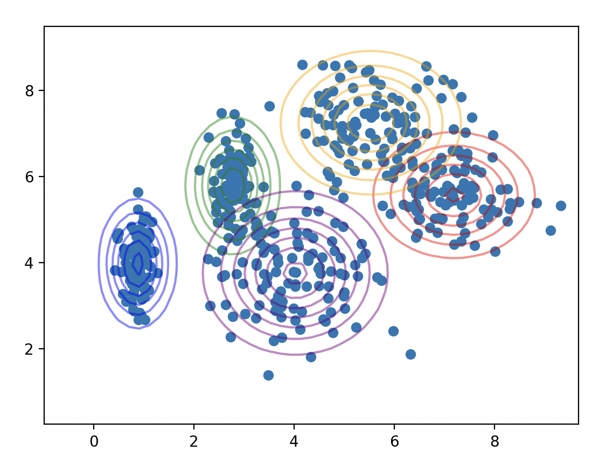

# Gaussian Mixture Model Pytorch #
Implements gaussian mixture models in pytorch. Loss is computed with respect to mean negative log likelihood and optimized via gradient descent.

<p align="center">

</p>

## Usage ##
Install requirements
```bash
python3 -m pip install -r requirements.txt
```

Run demo
```bash
python3 demo.py
```

<!---
## Derivation ##
TODO
-->


## Mixture Types ##
| Type       | Description                                                                   |
| ---------- | ----------------------------------------------------------------------------- |
| Full       | Fully expressive eigenvalues. Data can be skewed in any direction             |
| Diagonal   | Eigenvalues align with data axes. Dimensional variance is indepedent          |
| Isotropic  | Equal variance in all directions. Spherical distributions                     |
| Shared     | Equal variance in all directions for all components                           |
| Constant   | Variance is not learned and is equal across all dimensions and components     |

As of now only Full and Diagonal mixture types have been implemented

## Singularity Mitigation ##
From Pattern Recognition and Machine Learning by Christopher M. Bishop, pg. 433:
> Suppose that one of the components of the mixture model, let us say the jth component, has its mean μ_j exactly equal to one of the data points so that μ_j = x_n for some value of n. If we consider the limit σ_j → 0, then we see that this term goes to infinity and so the log likelihood function will also go to infinity. Thus the maximization of the log likelihood function is not a well posed problem because such singularities will always be present and will occur whenever one of the Gaussian components ‘collapses’ onto a specific data point.

A common solution to this problem is to reset the mean of the offending component whenever a singularity
appears. In practice, singularities are predicted by checking for NaN and Inf values, in which case it
is in guaranteed that the offending component can be identified. For this reason, all components are reset
and the model continues optimization from the new position.
